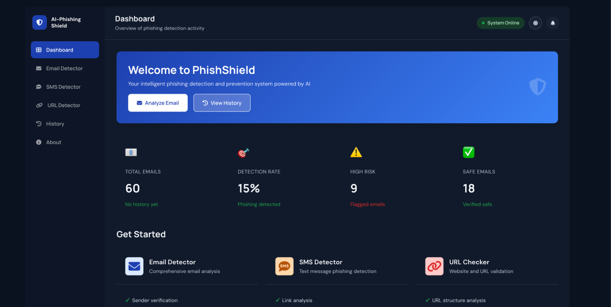
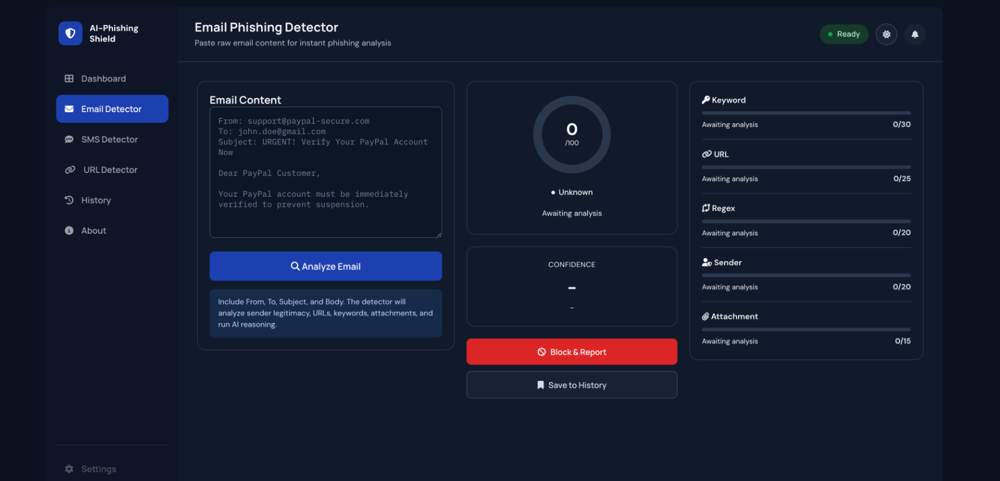
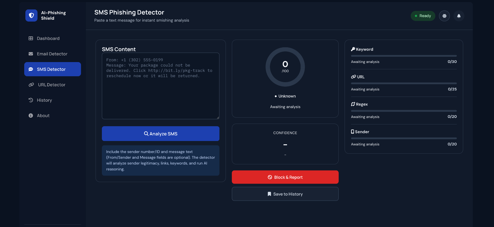
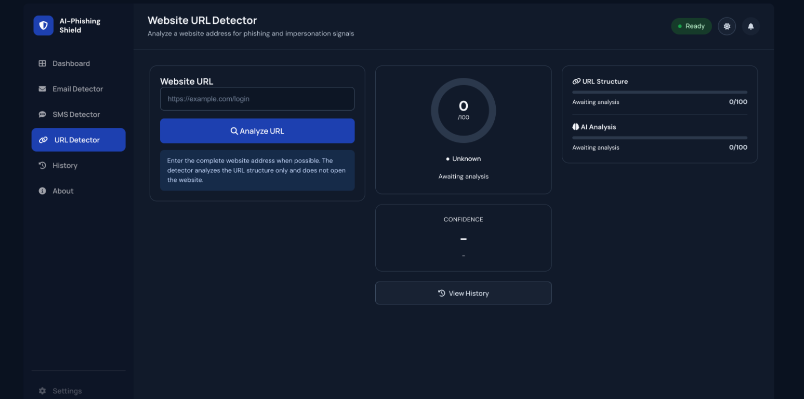

# AI Phishing Shield

AI Phishing Shield is a local Flask web application for analyzing **email, SMS text messages, and website URLs** for phishing indicators. It combines deterministic security checks with optional local AI reasoning, presents an explainable risk assessment, and stores analysis results in SQLite for later review.

The project is designed for cybersecurity education, controlled demonstrations, and local experimentation. It is not a replacement for an enterprise email security gateway or a professional incident-response process.

## Contents

- [Why This Project Exists](#why-this-project-exists)
- [What the Project Does](#what-the-project-does)
- [Recent Changes](#recent-changes)
- [Key Features](#key-features)
- [Screenshots and Page Guide](#screenshots-and-page-guide)
- [How the Application Works](#how-the-application-works)
- [Technology Stack](#technology-stack)
- [Project Structure](#project-structure)
- [Installation](#installation)
- [Running the Application](#running-the-application)
- [Using the Application](#using-the-application)
- [API Endpoints](#api-endpoints)
- [Database Storage](#database-storage)
- [Configuration](#configuration)
- [Troubleshooting](#troubleshooting)
- [Security and Privacy](#security-and-privacy)
- [Educational Value](#educational-value)
- [Limitations and Future Work](#limitations-and-future-work)

## Why This Project Exists

Phishing messages use social engineering, suspicious links, impersonation, urgency, and malicious files to influence users. A single indicator is not always enough to identify an attack, so this project demonstrates how multiple signals can be combined into one explainable assessment.

The application is also intended as a learning tool. It shows how a web interface, a Python backend, text parsers, detection modules, an AI service, and a database can work together in one full-stack security application.

## What the Project Does

The application accepts raw email content, SMS text messages, or a website URL through a browser. It then:

1. Parses useful fields such as sender, subject, links, phone numbers, and attachments (for email/SMS) or domain structure (for URLs).
2. Runs keyword, URL, regular-expression, sender, and attachment checks appropriate to the content type.
3. Optionally asks a local Ollama/Mistral model for contextual reasoning.
4. Combines detector scores into a final risk score from 0 to 100.
5. Assigns a risk level: Low, Moderate, High, or Critical.
6. Displays indicators, recommendations, detector scores, and an explanation.
7. Saves the result and relevant information to SQLite.

## Recent Changes

This section summarizes the most recent feature work added to the project:

### SMS (smishing) detector added

- New [`SMSParser`](utils/parsers/sms_parser.py) extracts sender, message body, links, and phone numbers from pasted SMS text (accepts either raw text or `From:`/`Message:` style fields).
- New [`SMSSenderDetector`](utils/detectors/sms_sender_detector.py) classifies the sender as a short code, ordinary phone number, or alphanumeric ID, and flags brand impersonation, premium-rate numbers, and spoofed sender IDs.
- New SMS analyzer page and `POST /api/analyze-sms` endpoint, reusing the keyword/URL/regex detectors and AI analyzer with SMS-specific prompts and score weighting (no attachment detector, since SMS has no file attachments).

### Website URL detector added

- New [`URLParser`](utils/parsers/url_parser.py) normalizes and validates a pasted URL (adds `https://` if missing a scheme, extracts domain/port/path/query parameters).
- `URLDetector.analyze_standalone_url()` checks a single URL for lexical phishing signals: missing HTTPS, IP-address hosts, URL shorteners, embedded credentials, punycode domains, excessive subdomains, non-standard ports, unusually long URLs, and account-action wording.
- New URL analyzer page and `POST /api/analyze-url` endpoint, combining lexical findings (60% weight) with AI reasoning (40% weight).

### Typosquat / brand-impersonation detection fix

- Added a shared fuzzy-matching helper, `TyposquatHelpers` (in [`utils/helpers.py`](utils/helpers.py)), that uses Levenshtein (edit-distance) comparison to catch lookalike brand names such as `ntflx.com` for `netflix.com` or `amzn-support.net` for `amazon.com`.
- Previously, all three brand-impersonation checks (URL, email sender, SMS sender) only matched an **exact substring** of the brand name, so abbreviated/character-dropped typosquats were invisible to the detectors. All three now use fuzzy matching in addition to the original exact-match checks.
- A confirmed brand-impersonation or typosquat match on a standalone URL now floors the final score at Critical, since it is one of the most decisive phishing signals available for a bare URL with no other corroborating detectors.

## Key Features

### Email analysis

- Paste raw email text into the analyzer.
- Upload `.txt` or `.eml` files.
- Extract sender, subject, URLs, email addresses, and attachment information.

### SMS (smishing) analysis

- Paste raw SMS text, either plain message text or structured `From:`/`Message:` fields.
- Classify the sender as a short code, ordinary phone number, or alphanumeric ID.
- Extract message body, links, and any phone numbers referenced in the text.
- Detect brand impersonation and spoofed sender IDs, including typosquatted lookalikes.

### Website URL analysis

- Paste a bare or full website URL (a missing `https://` scheme is added automatically).
- Inspect the URL's structure for phishing signals without visiting the destination: missing HTTPS, IP-address hosts, shortener services, embedded credentials, punycode, excessive subdomains, non-standard ports, unusually long URLs, and account-action wording.
- Detect brand impersonation and typosquatted domains (for example `ntflx.com` or `amaz0n-support.com`).

### Multi-detector analysis

- Keyword analysis for urgency, fear, and credential-request language.
- URL analysis for shortened URLs, IP-based links, and suspicious domains.
- Regular-expression matching for known phishing patterns.
- Sender reputation checks for suspicious domains, homograph attacks, and brand impersonation, including fuzzy/typosquat matching (for example `ntflx-security.com` or `amzn-support.net`).
- Attachment checks for dangerous extensions and macro-enabled files (email only).
- Optional AI reasoning through the locally hosted Mistral model, with content-specific prompts for email, SMS, and URL analysis.

### Explainable results

- Final numerical risk score.
- Risk-level classification.
- Individual detector scores and descriptions.
- Detected indicators.
- Recommendations for safe next steps.
- AI explanation when Ollama is available.

### History and dashboard

- Store analyses in a local SQLite database, across all three analysis types (email, SMS, URL).
- Review previous results with date, sender, subject, score, and risk level.
- Search and filter history.
- Export history as CSV.
- View aggregate counts and recent analyses on the dashboard.

### Education

The application includes pages explaining phishing types, common warning signs, protection practices, and actions to take after a possible compromise.

## Screenshots and Page Guide

The application is a single-page-style dashboard with a persistent sidebar. Each entry below explains what that page does and links to its route.

### Dashboard (`/dashboard`)



The landing page after opening the application. It shows a welcome banner with quick links to the analyzer and history pages, aggregate statistics (total analyses, detection rate, high-risk count, safe count), and a "Get Started" section with cards for each detector (Email, SMS, URL) that link directly to their analyzer pages. A "Recent Analyses" table at the bottom shows the latest saved results.

### Email Detector (`/analyzer`)



Paste raw email content (ideally including `From`, `To`, `Subject`, and body) or upload a `.txt`/`.eml` file, then select **Analyze Email**. The page displays a risk gauge (0-100), risk-level badge, confidence percentage, and a breakdown of five detector scores (Keyword, URL, Regex, Sender, Attachment). Below the grid, it shows top concerns, the full AI analysis (risk level, concerns, explanation, recommendation), and a phishing-indicator tip. Results can be saved to history or marked for blocking/reporting.

### SMS Detector (`/sms-analyzer`)



Paste SMS/text message content, either the raw message or structured `From:`/`Message:` fields, then select **Analyze SMS**. Functionally identical to the Email Detector, but tuned for text messages: it shows four detector scores instead of five (Keyword, URL, Regex, Sender - there is no Attachment detector, since SMS messages carry no file attachments), and the sender check classifies the message as coming from a short code, ordinary phone number, or alphanumeric sender ID.

### URL Detector (`/url-analyzer`)



Enter a website address (a missing `https://` scheme is added automatically) and select **Analyze URL**. Because a bare URL carries no body text or attachments, this page only shows two detector scores: URL Structure (lexical checks such as HTTPS usage, IP-address hosts, shorteners, punycode, and brand/typosquat impersonation) and AI Analysis (contextual reasoning from the local model). The detector does not visit or render the destination website - it only evaluates the URL string and structure.

### History (`/history`)

Lists every saved analysis (email, SMS, or URL) with its timestamp, type, risk score, and risk level. Supports searching by sender/subject, filtering by risk level, paging through results, and exporting the filtered set as a CSV file.

### About (`/about`)

Describes the project's mission and summarizes how the six-detector pipeline (keyword, URL, regex, sender, attachment, AI) works together to produce a risk score.

### Education (`/education`)

A reference guide covering what phishing is, common phishing types, how to spot warning signs, protective practices, and what to do if you believe you have been compromised.


## How the Application Works

```text
Browser
   |
   | HTML forms and JavaScript requests
   v
Flask application (app.py)
   |
   +--> PhishingDetectionEngine
   |       |
   |       +-- analyze_email()  --> EmailParser, KeywordDetector, URLDetector,
   |       |                        RegexDetector, SenderDetector, AttachmentDetector
   |       +-- analyze_sms()    --> SMSParser, KeywordDetector, URLDetector,
   |       |                        RegexDetector, SMSSenderDetector
   |       +-- analyze_url()    --> URLParser, URLDetector.analyze_standalone_url()
   |       |
   |       +-- AIAnalyzer --> Ollama/Mistral, when available (content-specific prompts)
   |       +-- RiskCalculator (per-content-type weighting)
   |       +-- TyposquatHelpers (shared fuzzy brand-matching, used by
   |               URLDetector, SenderDetector, and SMSSenderDetector)
   |
   +--> DatabaseManager --> SQLite
   |
   v
JSON response and rendered results
```


The three analysis routes are `POST /api/analyze` (email), `POST /api/analyze-sms` (SMS), and `POST /api/analyze-url` (website URL). Each route accepts JSON (or, for email, form data or an uploaded file), invokes the matching `PhishingDetectionEngine` method, saves the result, and returns a JSON response for its analyzer page.

## Technology Stack

### Backend

- Python 3.9 or newer
- Flask 3.1.0
- SQLite
- Requests for communication with Ollama
- python-dotenv for local environment configuration

### Frontend

- HTML5 templates with Jinja2
- CSS3 in `static/css/style.css`
- JavaScript for form handling, API calls, filtering, and dynamic results
- Font Awesome for interface icons

### Optional AI service

- Ollama running locally at `http://localhost:11434`
- Mistral model

The application remains usable with rule-based detection if Ollama is unavailable.

## Project Structure

```text
AI-Phishing-Shield/
|
|-- app.py                         Flask routes and application entry point
|-- requirements.txt               Python dependencies
|-- README.md                      Project documentation
|
|-- database/
|   |-- __init__.py
|   `-- db_manager.py              SQLite schema and database operations
|
|-- models/
|   |-- __init__.py
|   `-- detection_engine.py        Detector pipelines: analyze_email(), analyze_sms(), analyze_url()
|
|-- utils/
|   |-- helpers.py                 Shared helpers, including TyposquatHelpers (fuzzy brand matching)
|   |-- analyzers/
|   |   |-- ai_analyzer.py         Ollama integration, per-content-type prompts, and AI fallback
|   |   `-- risk_calculator.py     Risk score and risk-level calculation (per content type)
|   |-- detectors/
|   |   |-- keyword_detector.py    Suspicious language detection
|   |   |-- regex_detector.py      Pattern matching
|   |   |-- url_detector.py        URL inspection and standalone URL analysis
|   |   |-- sender_detector.py     Email sender reputation and typosquat detection
|   |   |-- sms_sender_detector.py SMS sender/short-code reputation and typosquat detection
|   |   `-- attachment_detector.py Dangerous file-type and macro detection (email only)
|   `-- parsers/
|       |-- email_parser.py        Sender, subject, links, and body parsing
|       |-- sms_parser.py          SMS sender, body, link, and phone parsing
|       `-- url_parser.py          Website URL normalization and parsing
|
|-- templates/
|   |-- base.html                  Shared Jinja layout
|   |-- index.html                 Home page
|   |-- analyzer.html              Email analysis interface
|   |-- sms_analyzer.html          SMS analysis interface
|   |-- url_analyzer.html          Website URL analysis interface
|   |-- dashboard.html             Statistics and recent analyses
|   |-- history.html               Stored analysis history
|   |-- about.html                 Project overview
|   |-- education.html             Phishing education guide
|   |-- 404.html                   Missing-page error page
|   `-- 500.html                   Server-error page
|
|-- static/
|   |-- css/style.css              Application styling
|   |-- script.js                  Shared browser utilities
|   |-- analyzer.js                Analyzer implementation reference
|   |-- dashboard.js               Dashboard implementation reference
|   `-- history.js                 History implementation reference
|
|-- uploads/                       Uploaded email files
|-- docs/
|   `-- screenshots/                Page screenshots referenced in this README
`-- database/phishing.db           Created automatically at runtime
```

The active analyzer, dashboard, and history behavior is currently implemented in inline script blocks inside their corresponding templates. `static/script.js` is loaded globally from `base.html`; the page-specific JavaScript files remain useful reference implementations unless they are explicitly linked into the templates.

## Installation

### Prerequisites

- Python 3.9 or newer
- `pip`
- A modern web browser
- Git, if cloning the project
- Ollama, only if local AI reasoning is required

### macOS and Linux

From the project directory:

```bash
python3 -m venv venv
source venv/bin/activate
python -m pip install --upgrade pip
pip install -r requirements.txt
```

### Windows

```powershell
python -m venv venv
venv\Scripts\activate
python -m pip install --upgrade pip
pip install -r requirements.txt
```

The database directory and SQLite database are created automatically when the application starts. The `uploads/` directory is also created automatically by `app.py`.

## Running the Application

Activate the virtual environment first, then run:

```bash
python3 app.py
```

On Windows, use:

```powershell
python app.py
```

Open the application at:

```text
http://127.0.0.1:5000
```

The current development configuration binds Flask to `127.0.0.1` on port `5000` with debug mode enabled.

### Run with local AI support

Install Ollama from [ollama.com](https://ollama.com), then run:

```bash
ollama pull mistral
ollama serve
```

Keep Ollama running in one terminal and start Flask in another. If Ollama is not running, the application uses its fallback analysis and continues to provide rule-based results.

### Stop the application

Press `Ctrl+C` in the terminal running Flask.

If port 5000 remains occupied on macOS or Linux, identify the process:

```bash
lsof -i :5000
```

Then stop the relevant process using its PID:

```bash
kill <PID>
```

Use `kill -9 <PID>` only when a normal termination does not work and you have confirmed the process belongs to this application.

## Using the Application

### Analyze an email

1. Open the Email Detector page.
2. Paste raw email content into the text area or upload a `.txt`/`.eml` file.
3. Include `From`, `To`, `Subject`, and the message body when possible.
4. Select Analyze Email.
5. Review the risk score, detector results, indicators, AI explanation, and recommendations.

### Analyze an SMS message

1. Open the SMS Detector page.
2. Paste the text message content, either as plain text or with `From:`/`Message:` fields.
3. Select Analyze SMS.
4. Review the risk score, sender classification, detector results, and AI explanation.

### Analyze a website URL

1. Open the URL Detector page.
2. Enter a website address (a missing `https://` scheme is added automatically).
3. Select Analyze URL.
4. Review the risk score, lexical URL findings, and AI explanation. The tool evaluates the URL string only and does not visit the destination.

### Review history

1. Open the History page.
2. Review the date, sender, subject, score, and risk level.
3. Search by sender or subject.
4. Filter records by risk level.
5. Export the filtered records as CSV when needed.

### Read educational material

Use the Education page to study phishing types, warning signs, protection steps, and response actions.

## API Endpoints

| Method | Endpoint | Purpose |
|---|---|---|
| `POST` | `/api/analyze` | Analyze pasted or uploaded email content and save the result |
| `POST` | `/api/analyze-sms` | Analyze SMS content and save the result |
| `POST` | `/api/analyze-url` | Analyze a website URL and save the result |
| `GET` | `/api/analyses` | Return saved analyses for the history page |
| `GET` | `/api/analyses?limit=5` | Return a limited set of recent analyses |
| `GET` | `/api/stats` | Return aggregate analysis statistics |
| `GET` | `/api/analysis/<id>` | Return one complete analysis by ID |
| `POST` | `/api/analysis/<id>/delete` | Delete one saved analysis |

Example JSON request:

```json
{
  "email_content": "From: sender@example.com\nSubject: Verify your account\n\nPlease review your account."
}
```

## Database Storage

The application uses SQLite at:

```text
database/phishing.db
```

The main table is `phishing_analysis`:

```sql
CREATE TABLE phishing_analysis (
    id INTEGER PRIMARY KEY AUTOINCREMENT,
    analysis_type TEXT NOT NULL,
    input_content TEXT NOT NULL,
    risk_score REAL NOT NULL,
    risk_level TEXT NOT NULL,
    detected_indicators TEXT NOT NULL,
    ai_explanation TEXT NOT NULL,
    recommendations TEXT NOT NULL,
    created_at TIMESTAMP DEFAULT CURRENT_TIMESTAMP,
    sender TEXT,
    subject TEXT
);
```

Lists such as detected indicators and recommendations are stored as JSON text and converted back into Python lists when a record is read.

The sender and subject are extracted by the email parser and stored directly in the database. This allows the history page to show accurate email information without trying to reconstruct headers from the message body.

To reset local history during development, stop the application and remove the database:

```bash
rm database/phishing.db
```

The database will be recreated the next time Flask starts. Do not delete the database if its records are needed.

## Configuration

The core application does not require an API key. Ollama is local and is accessed at:

```text
http://localhost:11434/api/chat
```

The application currently uses the `mistral` model. Configuration values can be moved to a `.env` file as the project evolves. Never commit credentials, private email content, or other sensitive values to version control.

## Troubleshooting

### `ModuleNotFoundError`

Confirm that the virtual environment is active and install dependencies again:

```bash
source venv/bin/activate
pip install -r requirements.txt
```

### Port 5000 is already in use

Check which process owns the port:

```bash
lsof -i :5000
```

Stop only the application process, or change the port in the `app.run()` configuration.

### AI analysis is unavailable

Verify that Ollama is running and that the Mistral model is installed:

```bash
ollama serve
ollama list
```

Rule-based detection continues to work when the AI service is unavailable.

### History shows old or incomplete sender information

Records created before sender and subject storage was added may not contain those fields. New analyses store the fields directly. Existing records cannot be reconstructed reliably if the original headers were not saved.

### Browser shows an old page

Refresh the page. During development, a hard refresh can clear cached frontend assets:

- macOS: `Cmd+Shift+R`
- Windows/Linux: `Ctrl+Shift+R`

## Security and Privacy

- This is an educational and local analysis tool, not a production security control.
- Do not upload confidential, regulated, or real incident data unless the environment has been approved for it.
- Treat all email content as untrusted input.
- Do not click links or open attachments from messages merely because the tool assigns a low score.
- Keep `.env` files and private database contents out of source control.
- Use a production WSGI server and hardened configuration before deploying beyond localhost.
- Detection results can contain false positives and false negatives.

## Educational Value

This project demonstrates:

- Flask routing and JSON API design.
- Jinja template inheritance and reusable layouts.
- HTML forms and browser-side JavaScript.
- Email parsing and regular-expression matching.
- Modular detector design.
- Combining weighted signals into a risk score.
- Local AI service integration with a fallback path.
- SQLite schema design and JSON serialization.
- Input validation, error handling, and safe rendering of untrusted content.

## Limitations and Future Work

Current limitations include:

- The application is intended for local development and education.
- AI quality depends on the installed Ollama model and local resources.
- Some detector rules are heuristic and require ongoing tuning.
- Typosquat detection uses edit-distance thresholds tuned for common cases; it can still miss more elaborate lookalikes and, rarely, flag legitimate short domain names.
- URL analysis evaluates address structure and metadata; it does not visit the destination or inspect live website content.
- The history detail action is currently a placeholder in the active template.
- Page-specific JavaScript is duplicated between inline template scripts and reference files in `static/`.

Possible future improvements include:

- Consolidating page JavaScript into the external files in `static/`.
- Adding automated tests for routes, detectors, and database operations.
- Implementing full history detail views and safer HTML rendering throughout.
- Adding authentication and role-based access for multi-user deployments.
- Adding structured logging, pagination at the API layer, and production deployment configuration.
- Expanding the monitored brand list and typosquat coverage used by the URL, email, and SMS sender detectors.

## License and Contributions

This repository is maintained as an educational project. Contributions that improve detection accuracy, documentation, accessibility, testing, or secure coding practices are welcome.
